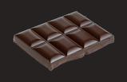
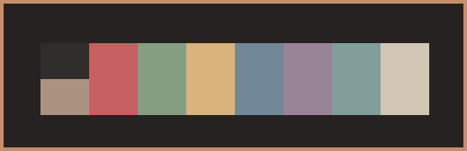
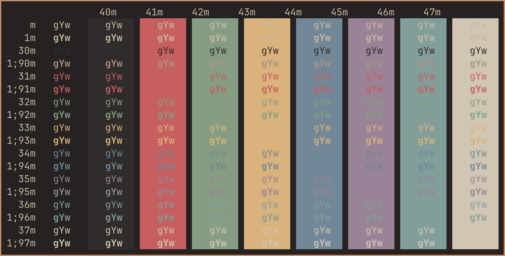

# Chocolate Ghostty
The Chocolate color scheme for Ghostty.

 

* [Ghostty for macOS and Linux](https://ghostty.org/)

* [Chocolate color scheme](https://gitlab.com/snakedye/chocolate) 

Place file in ~/.config/ghostty/themes/ (create folders if non-existing).

*Chocolate*

 

